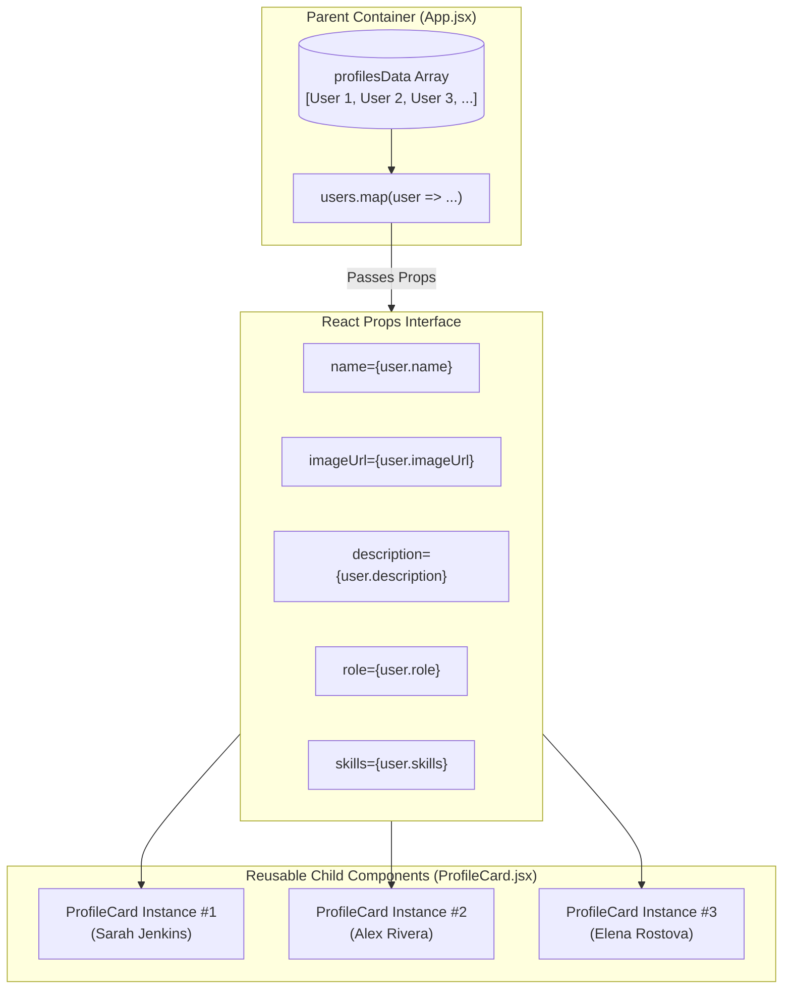

<div align="center">

# 🎴 Dynamic React Profile Cards

### A Modern, Responsive Profile Card Application built with React & Vite

[](https://react.dev/)
[](https://vitejs.dev/)
[](https://developer.mozilla.org/en-US/docs/Web/JavaScript)
[](LICENSE)
[](https://github.com/DA-Shaurya/profile_card/pulls)

<p align="center">
  A clean, modular, and component-driven web application demonstrating <strong>React Component Architecture</strong>, <strong>Unidirectional (Parent-to-Child) Data Flow</strong>, and <strong>Props Passing</strong> with dynamic user data and responsive layouts.
</p>

</div>

---

## 📖 Table of Contents

- [Overview](#-overview)
- [Key Features](#-key-features)
- [Architecture & Data Flow](#-architecture--data-flow)
- [Component API & Props](#-component-api--props)
- [Project Structure](#-project-structure)
- [Getting Started](#-getting-started)
- [Code Walkthrough](#-code-walkthrough)
- [UI & Styling Guide](#-ui--styling-guide)
- [Best Practices](#-best-practices)
- [Contributing](#-contributing)
- [License](#-license)
- [Author](#-author)

---

## 🌟 Overview

The **Profile Card Application** is an interactive React project designed to highlight best practices in frontend component design. At its core, the project demonstrates how data stored in a parent container (`App.jsx`) is passed down cleanly and predictably to reusable child presentational components (`ProfileCard.jsx`) using **React Props**.

Whether you are learning the fundamentals of React props, building a portfolio component library, or presenting a modular directory showcase, this repository serves as a clear, real-world reference implementation.

---

## ✨ Key Features

- 🧩 **Modular Component Design**: Decoupled presentation logic into reusable, single-responsibility components.
- 🔁 **Unidirectional Data Flow**: Strict parent-to-child state management ensuring predictable rendering.
- 📱 **Fully Responsive Layout**: Built with modern CSS Grid and Flexbox for seamless viewing across mobile, tablet, and desktop screens.
- 🎨 **Sleek Modern UI**: Smooth hover lift transitions, subtle shadows, clean typography, and polished badge elements.
- ⚡ **Instant HMR with Vite**: Lightning-fast hot module replacement and optimized build tooling.
- 🛡️ **Defensive Rendering**: Fallback avatars and default prop fallbacks to prevent broken image links or missing data states.

---

## 🏛️ Architecture & Data Flow

In React, data flows in one direction: from top to bottom (Parent to Child). This is known as **Unidirectional Data Flow**.

- **Parent (`App.jsx`)**: Acts as the single source of truth for the dataset. It manages the array of user profile objects and renders the layout wrapper.
- **Props (`name`, `imageUrl`, `description`, ...)**: Read-only attributes passed into child JSX tags.
- **Child (`ProfileCard.jsx`)**: Pure presentational component that consumes incoming props and renders the customized card UI.



### Why React Props?

1. **Immutability**: Props are read-only (`Object.freeze` semantics in development). A child component cannot directly modify its received props, preventing side effects.
2. **Reusability**: One `ProfileCard` component definition can render dozens of distinct cards with different content.
3. **Maintainability**: If the card UI design changes, you only update `ProfileCard.jsx`. If the dataset changes, you only update the data source in `App.jsx`.

---

## 🎛️ Component API & Props

The `ProfileCard` component accepts structured props that govern its display. Below is the complete API specification:

| Prop Name | Type | Required | Default | Description |
| :--- | :--- | :---: | :--- | :--- |
| `name` | `string` | **Yes** | `—` | Full name of the individual displayed in the card header. |
| `imageUrl` | `string` | **Yes** | `—` | HTTPS URL for the profile portrait image. |
| `description` | `string` | **Yes** | `—` | Brief biography or technical specialization summary. |
| `role` | `string` | No | `"Software Specialist"` | Job title or primary professional function. |
| `location` | `string` | No | `"Remote"` | Geographic location or work arrangement. |
| `skills` | `Array<string>` | No | `[]` | List of technical badges rendered inside the skill pills. |
| `isOnline` | `boolean` | No | `false` | Availability status toggling the green/gray indicator dot. |
| `projectsCount`| `number` | No | `0` | Number of completed projects/contributions badge. |
| `rating` | `string` | No | `"5.0"` | Client or peer review score displayed with star icon. |

### Prop Type Definition & Destructuring Pattern

```jsx
// components/ProfileCard.jsx
export default function ProfileCard({
  name,
  imageUrl,
  description,
  role = "Software Specialist",
  location = "Remote",
  skills = [],
  isOnline = false,
  projectsCount = 0,
  rating = "5.0"
}) {
  // Component implementation...
}
```


