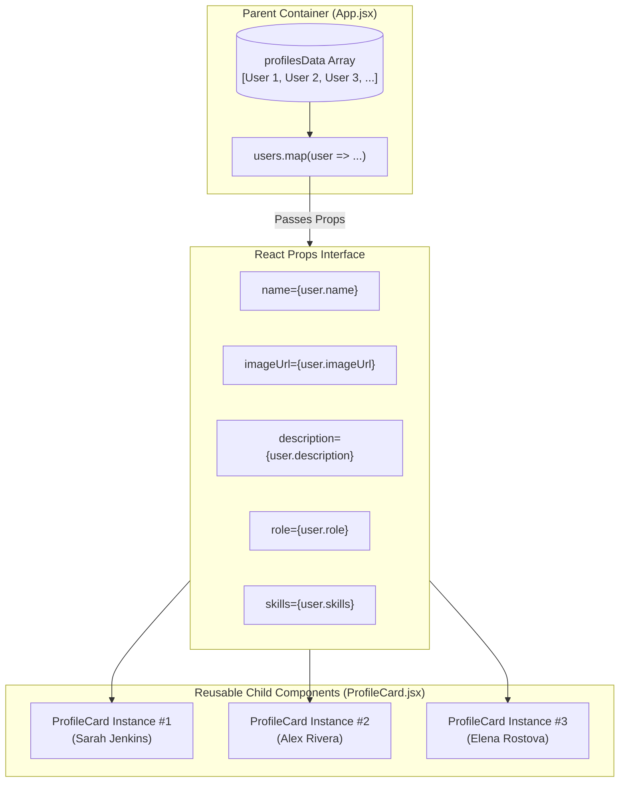

<div align="center">

# 🎴 Dynamic React Profile Cards

### A Modern, Responsive Profile Card Application built with React & Vite

[](https://react.dev/)
[](https://vitejs.dev/)
[](https://developer.mozilla.org/en-US/docs/Web/JavaScript)
[](LICENSE)
[](https://github.com/DA-Shaurya/profile_card/pulls)

<p align="center">
  A clean, modular, and component-driven web application demonstrating <strong>React Component Architecture</strong>, <strong>Unidirectional (Parent-to-Child) Data Flow</strong>, and <strong>Props Passing</strong> with dynamic user data and responsive layouts.
</p>

</div>

---

## 📖 Table of Contents

- [Overview](#-overview)
- [Key Features](#-key-features)
- [Architecture & Data Flow](#-architecture--data-flow)
- [Component API & Props](#-component-api--props)
- [Project Structure](#-project-structure)
- [Getting Started](#-getting-started)
- [Code Walkthrough](#-code-walkthrough)
- [UI & Styling Guide](#-ui--styling-guide)
- [Best Practices](#-best-practices)
- [Contributing](#-contributing)
- [License](#-license)
- [Author](#-author)

---

## 🌟 Overview

The **Profile Card Application** is an interactive React project designed to highlight best practices in frontend component design. At its core, the project demonstrates how data stored in a parent container (`App.jsx`) is passed down cleanly and predictably to reusable child presentational components (`ProfileCard.jsx`) using **React Props**.

Whether you are learning the fundamentals of React props, building a portfolio component library, or presenting a modular directory showcase, this repository serves as a clear, real-world reference implementation.

---

## ✨ Key Features

- 🧩 **Modular Component Design**: Decoupled presentation logic into reusable, single-responsibility components.
- 🔁 **Unidirectional Data Flow**: Strict parent-to-child state management ensuring predictable rendering.
- 📱 **Fully Responsive Layout**: Built with modern CSS Grid and Flexbox for seamless viewing across mobile, tablet, and desktop screens.
- 🎨 **Sleek Modern UI**: Smooth hover lift transitions, subtle shadows, clean typography, and polished badge elements.
- ⚡ **Instant HMR with Vite**: Lightning-fast hot module replacement and optimized build tooling.
- 🛡️ **Defensive Rendering**: Fallback avatars and default prop fallbacks to prevent broken image links or missing data states.

---

## 🏛️ Architecture & Data Flow

In React, data flows in one direction: from top to bottom (Parent to Child). This is known as **Unidirectional Data Flow**.

- **Parent (`App.jsx`)**: Acts as the single source of truth for the dataset. It manages the array of user profile objects and renders the layout wrapper.
- **Props (`name`, `imageUrl`, `description`, ...)**: Read-only attributes passed into child JSX tags.
- **Child (`ProfileCard.jsx`)**: Pure presentational component that consumes incoming props and renders the customized card UI.



### Why React Props?

1. **Immutability**: Props are read-only (`Object.freeze` semantics in development). A child component cannot directly modify its received props, preventing side effects.
2. **Reusability**: One `ProfileCard` component definition can render dozens of distinct cards with different content.
3. **Maintainability**: If the card UI design changes, you only update `ProfileCard.jsx`. If the dataset changes, you only update the data source in `App.jsx`.

---

## 🎛️ Component API & Props

The `ProfileCard` component accepts structured props that govern its display. Below is the complete API specification:

| Prop Name | Type | Required | Default | Description |
| :--- | :--- | :---: | :--- | :--- |
| `name` | `string` | **Yes** | `—` | Full name of the individual displayed in the card header. |
| `imageUrl` | `string` | **Yes** | `—` | HTTPS URL for the profile portrait image. |
| `description` | `string` | **Yes** | `—` | Brief biography or technical specialization summary. |
| `role` | `string` | No | `"Software Specialist"` | Job title or primary professional function. |
| `location` | `string` | No | `"Remote"` | Geographic location or work arrangement. |
| `skills` | `Array<string>` | No | `[]` | List of technical badges rendered inside the skill pills. |
| `isOnline` | `boolean` | No | `false` | Availability status toggling the green/gray indicator dot. |
| `projectsCount`| `number` | No | `0` | Number of completed projects/contributions badge. |
| `rating` | `string` | No | `"5.0"` | Client or peer review score displayed with star icon. |

### Prop Type Definition & Destructuring Pattern

```jsx
// components/ProfileCard.jsx
export default function ProfileCard({
  name,
  imageUrl,
  description,
  role = "Software Specialist",
  location = "Remote",
  skills = [],
  isOnline = false,
  projectsCount = 0,
  rating = "5.0"
}) {
  // Component implementation...
}
```

---

## 🚀 Getting Started

Follow these steps to clone, configure, and launch the project on your local machine.

### Prerequisites

Ensure you have the following installed on your system:
- **Node.js**: `v18.0.0` or higher ([Download Node.js](https://nodejs.org/))
- **npm** (bundled with Node) or **yarn** / **pnpm**

Check your current versions:
```bash
node -v
npm -v
```

### Installation

1. **Clone the repository:**
   ```bash
   git clone https://github.com/DA-Shaurya/profile_card.git
   cd profile_card
   ```

2. **Install project dependencies:**
   ```bash
   npm install
   ```

3. **Start the local Vite development server:**
   ```bash
   npm run dev
   ```
   Open your browser and navigate to `http://localhost:5173` (or the port output in your terminal).

### Available Scripts

| Command | Action |
| :--- | :--- |
| `npm run dev` | Starts the local development server with Vite hot module replacement (HMR). |
| `npm run build` | Compiles and optimizes assets into the production-ready `dist/` directory. |
| `npm run preview` | Locally serves the production build from `dist/` for pre-deployment testing. |

---

## 📁 Project Structure

The project follows a clean, maintainable structure isolating data, reusable components, and top-level application containers:

```
profile_card/
├── 📁 components/              # Reusable React components
│   ├── ProfileCard.jsx        # Modular profile card receiving props
│   └── PropsBanner.jsx        # Architecture overview banner component
├── 📁 data/                    # Dynamic mock datasets
│   └── profiles.js            # Array of user profile data objects
├── App.css                    # Main layout and responsive styling
├── App.jsx                    # Root container component (passes props)
├── index.css                  # Global CSS reset & typography rules
├── index.html                 # HTML5 entry template
├── main.jsx                   # React root hydration / DOM mount
├── package.json               # Dependencies and build scripts
├── ProfileCard.css            # Scoped styles for the profile card
├── ProfileCard.jsx            # Standalone child component export
├── vite.config.js             # Vite build and plugin configurations
└── README.md                  # Comprehensive project documentation
```

### Module Responsibilities

- **`data/profiles.js`**: Contains structured profile data (id, name, role, bio, avatar, skills, badges) imitating an API response.
- **`components/ProfileCard.jsx`**: Pure UI component consuming props. Implements image error fallback handling and hover interaction states.
- **`components/PropsBanner.jsx`**: Visual aid illustrating parent-to-child data flow and live profile filter buttons.
- **`App.jsx`**: Holds state, filters data, maps over array items, and injects props into child instances.

---

## 💻 Code Walkthrough

### 1. Declaring Data in the Parent Container

In `App.jsx`, user profile records are organized in an array of objects. Each profile object has an immutable unique identifier (`id`):

```jsx
// App.jsx
const users = [
  {
    id: 1,
    name: "Sarah Jenkins",
    imageUrl: "https://images.unsplash.com/photo-1494790108377-be9c29b29330?auto=format&fit=crop&w=400&q=80",
    description: "Software Architect specializing in building scalable web applications and cloud solutions."
  },
  {
    id: 2,
    name: "Alex Rivera",
    imageUrl: "https://images.unsplash.com/photo-1507003211169-0a1dd7228f2d?auto=format&fit=crop&w=400&q=80",
    description: "UI/UX Designer passionate about human-centered design and modern user interfaces."
  }
];
```

### 2. Passing Props via Iteration (`map`)

Using JavaScript's `.map()` method, the parent dynamically instantiates child components, passing each property as an individual prop alongside a unique `key`:

```jsx
<main className="cards-grid">
  {users.map((user) => (
    <ProfileCard
      key={user.id}
      name={user.name}
      imageUrl={user.imageUrl}
      description={user.description}
    />
  ))}
</main>
```

### 3. Receiving & Rendering Props in Child

In `ProfileCard.jsx`, the component receives the `props` object and extracts properties using parameter destructuring:

```jsx
function ProfileCard({ name, imageUrl, description }) {
  return (
    <div className="profile-card">
      
      <h2 className="profile-name">{name}</h2>
      <p className="profile-description">{description}</p>
    </div>
  );
}

export default ProfileCard;
```

---

## 🎨 UI & Styling Guide

The styling is engineered to be lightweight, modern, and dependency-free:

### 1. Responsive Auto-Fitting Grid

The cards utilize a dynamic CSS Grid layout that automatically calculates columns based on available viewport width, eliminating jarring breakpoints:

```css
.cards-grid {
  display: grid;
  grid-template-columns: repeat(auto-fit, minmax(240px, 1fr));
  gap: 2rem;
  margin-bottom: 4rem;
}
```

### 2. Micro-Interactions & Hover Lift

Cards feature subtle elevational cues to provide tactile user feedback:

```css
.profile-card {
  transition: transform 0.25s ease, box-shadow 0.25s ease;
}

.profile-card:hover {
  transform: translateY(-6px);
  box-shadow: 0 12px 25px rgba(0, 0, 0, 0.1);
  border-color: #cbd5e1;
}
```

### 3. Graceful Image Loading & Fallbacks

Network errors or broken image URLs automatically trigger dynamic SVG placeholder avatars with user initials:

```jsx
const [imgError, setImgError] = useState(false);

const fallbackAvatar = `https://ui-avatars.com/api/?name=${encodeURIComponent(
  name || "User"
)}&background=4f46e5&color=fff&size=200&bold=true`;

 setImgError(true)}
  loading="lazy"
/>
```

---

## 💡 Best Practices & FAQs

### Key Concepts Applied

1. **Stable Keys in Iteration**:
   Always use unique persistent IDs (`user.id`) rather than array indices for the `key` prop. This allows React's diffing algorithm to correctly identify mutated, added, or deleted nodes without full subtree re-renders.

2. **Default Prop Values**:
   Use ES6 default arguments (e.g., `role = "Software Specialist"`) to provide predictable fallbacks when optional props are omitted by the parent.

3. **Separation of Concerns**:
   Keep data retrieval and state logic in the parent container (`App.jsx`), while keeping presentational rendering in the child component (`ProfileCard.jsx`).

### Frequently Asked Questions

<details>
<summary><strong>Q: Can a child component modify its received props?</strong></summary>

> **No.** In React, props are read-only and immutable. If a child component needs to trigger changes in parent data, the parent must pass a callback function as a prop (e.g., `onDelete={handleDelete}`) which the child invokes.
</details>

<details>
<summary><strong>Q: Why use Vite instead of Create React App (CRA)?</strong></summary>

> Vite leverages native browser ES Modules (ESM) and esbuild to deliver millisecond-level cold server start times and instant Hot Module Replacement (HMR), whereas CRA uses slower bundled Webpack setups.
</details>

<details>
<summary><strong>Q: How do I add my own profile to the cards?</strong></summary>

> Open `data/profiles.js` (or the `users` array in `App.jsx`) and append a new object containing `id`, `name`, `imageUrl`, and `description`. The grid will automatically re-render and include your new card.
</details>

---

## 🤝 Contributing

Contributions, issues, and feature requests are welcome!

1. Fork the Project (`https://github.com/DA-Shaurya/profile_card/fork`)
2. Create your Feature Branch (`git checkout -b feature/AmazingFeature`)
3. Commit your Changes (`git commit -m 'feat: Add some AmazingFeature'`)
4. Push to the Branch (`git push origin feature/AmazingFeature`)
5. Open a Pull Request

---

## 📄 License

Distributed under the **MIT License**. See [`LICENSE`](LICENSE) for more information.

---

## 👨‍💻 Author

**Shaurya Singh**

- GitHub: [@DA-Shaurya](https://github.com/DA-Shaurya)
- Repository: [DA-Shaurya/profile_card](https://github.com/DA-Shaurya/profile_card)

---

<div align="center">
  <sub>Built with ❤️ by Shaurya Singh &bull; Powered by React & Vite</sub>
</div>
